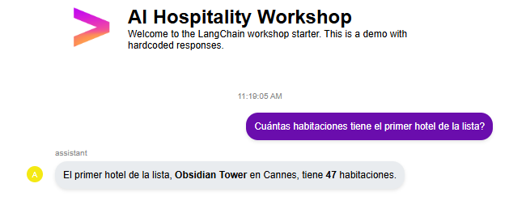

# Exercise 0 – Simple Agentic Assistant

## Cinfiguraciones previas

- **Ruta del entorno virtual.**
```bash
/home/manuelmaturana/PRJ/hospitality_PoC
```

- **Creación del entorno virtual.**
```bash
python3 -m venv venv
```

- **Configurar .gitignore**: creamos un `.gitignore` para que git ignore las dependencias del venv. Dentro de `.gitignore` escribimos `venv` y commiteamos.

- **Instalación de las dependencias**: existen dos `requirements.txt`en diferentes rutas pertinentes antes de afrontar el ejercicio 0. Partimos de `/home/manuelmaturana/PRJ/hospitality_PoC` para instalar lo referente a `langchain`, `langchain-google-genai`...
```bash
pip install -r ./bookings-db/requirements.txt
pip install -r ./ai_agents_hospitality/requirements.txt
```

- Configuramos la API_KEY como variable de entorno dentro del `bashrc.` del WSL para no tener que hardcodearla **(PELIGROSO)**.  En nuestro caso, al ser de GoogleStudio hay que exportar la clave como dicta la configuración del agente (`config_agent.py`). Aquí se identifica la key como `"AI_AGENTIC_API_KEY"`, exportamos esta variable con nuestra key y le reasignamos `"GEMINI_API_KEY"` (si no no la encuentra).

```bash
export AI_AGENTIC_API_KEY="xxxxxxxxxxxxxx"
export GEMINI_API_KEY="$AI_AGENTIC_API_KEY"
```

## Branch

Antes de ponernos  a toquetear nada dentro de visual studio, traemos la versión actualizada del repo y nos situamos en la rama main.

```bash
git fetch -all
```

- **Checkout a la rama del workshop**
```bash
git checkout -b feature/langchain_workshop_exercise0 \
  origin/feature/langchain_workshop_exercise0
```

donde `feature/langchain_workshop_exercise0` es la rama que creo yo y dónde se desarrollarán todos los commits del ejercicio 0 (este `.md` y poco más) y `origin/feature/langchain_workshop_exercise0` es la del repo de David con `origin` delante para decirle al git que me la traiga del repo original.

### Resumen requisitos previos:

- Generar entorno virutal `venv` e ignorarlo en `.gitignore`.
- Instalar dependencias de ambos `requirements.txt`.
- Exportación y configuración de la API_KEY `export AI_AGENTIC_API_KEY="xxxxxxxxxxxxxx"`
- Traer la última versión del repo y hacer el checkout a nuestra rama `feature/langchain_workshop_exercise0 `.

## Datos sintéticos

- Dentro del workshop, el proyecto **Hotel Bookings Database** emplea una base PostgreSQL para el booking de hoteles para generar datos sintéticos.

- A nosotros por ahora sólo nos interesa el script `gen_synthetic_hotels.py` para completar una serie de archivos con información sintética de hoteles y bookings a partir unos tmeplates proporcionados por los .yaml del proyecto rollo nombre del hotel, número de habitaciones, ciudad,...

```bash
python3 ./bookings-db/src/gen_synthetic_hotels.py
``` 
- De esta forma se generan los datos sintéticos para los hoteles y los bookings en `bookings-db/output_files/`:
  - **`bookings`**
    - `all_bookings.xlsx`
  - **`hotels`**
    - `hotels.json`
    -  `hotels.xlsx`
    -  `hotels.csv`
    - `all_hotels.csv`
    - `hotel_details.md`
    - `hotel_rooms.md`
    - `hotel_room_queries.csv`

## Core Implementation

Aquí ya indagamos en el funcionaminto del agente `hotel_simple_agent.py` dentro de `ai_agents_hospitality`

### Load del contexto

- De un contenedor, ya sea el local en `/data` o el externo de los datos sintéticos generados necesitamos cargar el `hotels.json` con los datos pertinentes de los hoteles que se hayan generado. 

- Para usar los datos sintéticos nos cargamos este `if` dentro de la función que obiene la ruta de los datos `get_hotels_data_path()`
```python
if HOTELS_DATA_PATH_LOCAL.exists() and (HOTELS_DATA_PATH_LOCAL / "hotels.json").exists():
        logger.info(f"Using local hotel data path: {HOTELS_DATA_PATH_LOCAL}")
        return HOTELS_DATA_PATH_LOCAL
```
 - La función que carga los datos, sean sintéticos o no:

```python
def load_hotel_data() -> Tuple[dict, str]:
```

- Usa `get_hotels_data_path()` para decidir la ruta.
- Maneja los errores.
- Carga los datos

```python
hotels_json_file = hotels_data_path / "hotels.json"

with open(hotels_json_file, 'r', encoding='utf-8') as f:
    _hotels_data = json.load(f)
```

En la misma función se gestionan los datos de los hoteles :

```python
hotel_details_file = hotels_data_path / "hotel_details.md"

with open(hotel_details_file, 'r', encoding='utf-8') as f:
        _hotel_details_text = f.read()
```

Al cargar estos dos ficheros, ya sean locales o los externos, estamos añadiendo contexto al prompt que usará el agente para contestar a la query sin necesidad de RAG.

### Cadena de Langchain

Establecemos la configuración del agente creando una cadena de langchain en la función `_create_agent_chain()`:

- El llm valoramos la posibilidad de emplear una API de OpenAI o de Google.
```python
if config.provider == "openai":
    llm = ChatOpenAI(
            model=config.model,
            temperature=config.temperature,
            api_key=config.api_key
        )
else:
        # Standard Gemini API usage
        llm = ChatGoogleGenerativeAI(
            model=config.model,
            temperature=config.temperature,
            google_api_key=config.api_key
        )
```

- Una configuración de prompt usando el método `.from_messages` sobre un objeto `ChatPromptTemplate`. Su usa dentro del prompt `hotel_context` que no es más que el .md con los detalles de los hoteles y la `question` del user.

- Finalmente tenemos la cadena simple de langchain:
```python
_agent_chain = prompt_template | llm
```

### Contestar la question

Con la función `answer_hotel_question(question:str)` recuperamos la cadena de langchain y le pasamos al contexto los detalles del hotel (`hotel_context`) y preguntas pertinentes. Además añadimos al contexto el `json.dump` de los datos estructurados del hotel (`hotels.json`). (Aunque no sé muy bien dónde se usa este json.dump dentro del prompt/contexto la verdad)

```python

chain = _create_agent_chain()
        
        # Invoke the chain
        logger.info(f"Processing question: {question[:100]}...")
        response = chain.invoke({
            "hotel_context": hotel_context,
            "question": question
        })
        return response.content
```

donde el return es el texto plano del `invoke` del modelo.

Finalmente, en la función `handle_hotel_query_simple(user_query: str)` le pasamos la query del usuario y ésta devuelve el resultado de `answer_hotel_question(question:str)` usando `user_query`a modo de `question`.

## Pruebas

A través de distints queries como pedir listados, información de las habitaciones y planes de comida se observa el flujo a través de los logs.

- Se escribe la query 



- El WebSocket conecta el backend con el fronted y la query llega al primero.

- Al ejecutar `main.py` hacemos la llamada a `handle_hotel_query_simple` 

- Tras la ejecución del flujo del agente (contexto + prompt + llm) la respuesta vuelve al frontend.


