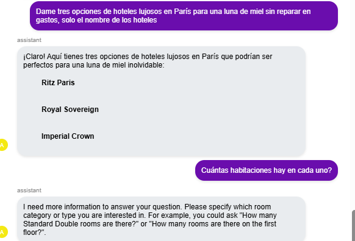
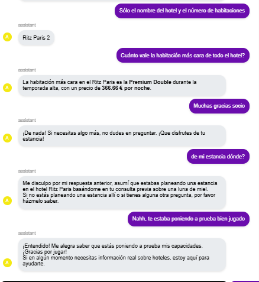
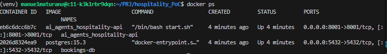

# WORKSHOP RESOLUTION

# 1 RAG + Tools

## 📋 Descripción

Implementación de un agente inteligente de consultas hoteleras usando **RAG (Retrieval-Augmented Generation)** con LangChain, ChromaDB y Google Generative AI.

El agente es capaz de:
- ✅ Responder preguntas en lenguaje natural sobre hoteles
- ✅ Buscar información relevante en una base de conocimiento vectorial (50 hoteles)
- ✅ Usar herramientas especializadas para consultas estructuradas (búsqueda, conteo, precios)
- ✅ Generar respuestas precisas y completas en formato Markdown

---

### Componentes principales:

1. **Vector Store (ChromaDB)**
   - 50 hoteles sintéticos de Francia (París, Nice, Cannes)
   - Embeddings generados con Google Generative AI
   - Búsqueda semántica por similitud

2. **Tools (Herramientas especializadas)**
   - `search_hotels_by_city`: Busca hoteles en una ciudad específica
   - `list_all_hotels`: Lista todos los hoteles disponibles
   - `count_rooms`: Cuenta habitaciones con filtros opcionales
   - `get_room_prices`: Obtiene precios de habitaciones

3. **Agente Orquestador**
   - Decide automáticamente cuándo usar tools vs RAG
   - Combina resultados de múltiples fuentes
   - Formatea respuestas en lenguaje natural

4. **RAG Chain**
   - Recupera contexto relevante del vector store (k=20 chunks)
   - Genera respuestas basadas en documentos reales
   - Responde preguntas descriptivas y cualitativas

---

## 🚀 Instalación y Setup

### Requisitos previos

- Python 3.10+
- Google API Key (para Gemini)
- Docker & Docker Compose (opcional, para producción)


- Instalamos las dependencias necesarias para el RAG de langchain y el vector store `chromadb`.

- Generamos los datos sintéticos de 50 hoteles que va a usar el RAG con `gen_synthetic_hotels.py`. Para cambiar a 50 hoteles hay que indagar en la configuración de del bookings hasta `generate_hotels_param.yaml` y hardcodear el 50.

```bash
python3 gen_synthetic_hitels.py
```

- Creamos el script del Rag (`hotel_rag_agent.py`) en `\home\manuelmaturana\hospitality_PoC\ai_agents_hospitality\agents`.


## 1.1 Loader

Para tratar documentos locales primero hay que pasar estos a texto plano usando `loaders`.

```python
def load_hotel_documents()-> List:
    
    documents= []

    json_path= DATA_PATH / "hotels.json"

    json_loader= JSONLoader(file_path=str(json_path), jq_schema= '.Hotels[]', text_content=False)
    json_docs= json_loader.load()
    documents.extend(json_docs)
    
    return documents
```

## 1.2 Chunking

Tras pasar los datos sintéticos a texto plano legible de tipo `document` dividimos éstos en chunks en pos de un mejor retrieval posterior

```python
def split_documents(documents: List)->List:
        text_splitter= RecursiveCharacterTextSplitter(
        chunk_size= 1000,
        chunk_overlap= 200,
        length_function= len,
        separators=["\n\n", "\n", " ", ""] 
    )

    chunks= text_splitter.split_documents(documents= documents)
    logger.info(f"Split {len(documents)} documents into {len(chunks)} chunks")
    
    return chunks
```

## 1.3 VectorStore 
Creamos un vectorstore donde almacena embeddings de los documentos. Si ya existe en disco lo carga desde ahí.
```python
def get_or_create_vectorstore(force_rebuild: bool= False):
    # Si ya está cargado enla memoria que lo devuelva
    if _vectorstore is not None and not force_rebuild:
    # Configurar los embeddings (modelo de google)
    agent_config= get_agent_config()
    embeddings= GoogleGenerativeAIEmbeddings(model= "models/embedding-001", api_key= agent_config.api_key)

    # Si no existe lo creamos de 0

    documents= load_hotel_documents()
    if not documents:
        raise ValueError("No documents loaded. cannot create embeddings")
    
    # 2 Chunkear los documents
    chunks= split_documents(documents)

    # 3 Crear vectorstore con ChromaDB
    _vectorstore= Chroma.from_documents(documents= chunks,
        embedding= embeddings,
        persist_directory= str(VECTOR_STORE_PATH))
 
    return _vectorstore
```

Siguiendo el orden del workshop, a continuación creamos la cadena del RAG usando `langchain`. Luego veremos un paso intermedio entre el vectorstore y la cadena.

## 1.4 RAG Chain

```python

def create_rag_chain():

    #Usaremos esta función también a la hora de tratar la query así que si ya existe la devolvemos

    if _rag_chain is not None:
        logger.info("Using cached RAG chain")
        return _rag_chain
        
    agent_config= get_agent_config()
    # Creamos el llm instance
    llm= ChatGoogleGenerativeAI(
        model= agent_config.model,
        temperature= agent_config.temperature,
        google_api_key= agent_config.api_key
    )

    # Obetener el vectorstore y crear retriever

    vectorstore= get_or_create_vectorstore()

    # Hacer el prompt

    system_prompt = "PROMPT ESPECÍFICO"

    # Crear la plantilla del prompt

    prompt_template= ChatPromptTemplate.from_messages([
        ("system", system_prompt),
        ("user", "{question}")
    ])

    # guardar en el cache

    _rag_chain= {"llm": llm, "vectorstore": vectorstore, "prompt": prompt_template}
    logger.info("RAG chain created succesfully")
    return _rag_chain
```

También gestionamos después la función para gestionar la query.

```python
sync def handle_hotel_query_rag(query: str)-> str:
    try:
        # 1 Obtener la cadena de RAG
        rag_chain= create_rag_chain()
        llm= rag_chain.get("llm")
        vectorstore = rag_chain.get("vectorstore")
        prompt_template= rag_chain.get("prompt")

        # 2 Recuperar los documentos más relevantes para el contexto
        logger.info(f"Processing query: {query}")
        relevant_docs= vectorstore.similarity_search(query, k=5)
        logger.info(f"Found {len(relevant_docs)} relevant documents")

        # 3 Construir el contexto

        context= "\n\n".join([doc.page_content for doc in relevant_docs])

        # 4 Crear prompt con contexto

        messages= prompt_template.format_messages(
            context= context, 
            question= query
            )
        
        # 5 Respuesta
        
        response= llm.invoke(messages)

        logger.info("Response generated successfully")
        return response.content
```


## 1.5 Herramientas (Tools) del Agente RAG - Exercise 1

### 📋 Resumen Ejecutivo

Durante la implementación del Exercise 1, creamos **4 herramientas especializadas** para complementar el sistema RAG. Estas tools permiten al agente realizar consultas estructuradas sobre datos exactos que requieren filtrado, conteo o agregación, tareas donde el RAG puro (búsqueda semántica) no es óptimo.

---


El **RAG puro** tiene limitaciones:

1. **No es determinístico para datos exactos**
   - Pregunta: "¿Cuántas habitaciones hay en París?"
   - RAG: Recupera chunks aleatorios → Puede contar mal o perder información

2. **Limitación de chunks (k=20)**
   - Con 50 hoteles, 20 chunks no cubren todos los datos
   - Respuestas incompletas: "Aquí hay 15 hoteles..." (cuando hay 20 en París)

3. **Mal para operaciones de agregación**
   - Contar, sumar, filtrar → requiere procesar TODOS los datos
   - RAG solo ve una "muestra" de documentos

4. **Ineficiente para consultas estructuradas**
   - "Lista todos los hoteles en Nice"
   - RAG: Busca semánticamente → lento, puede fallar
   - Tool: Filtra JSON directamente → rápido, 100% preciso

## 1.6 🔧 Las 4 Herramientas Implementadas

### 1. `search_hotels_by_city(city: str)`

**Propósito:** Buscar hoteles en una ciudad específica.

**Cuándo se usa:** 
- "Hoteles en París"
- "Lista hoteles en Nice"
- "Qué hoteles hay en Cannes"

**Por qué es necesaria:**
- Filtrado exacto por ciudad (no confusión semántica)
- Acceso directo al JSON → 100% precisión
- Más rápido que búsqueda semántica

**Ejemplo:**
```python
# Input: "Hoteles en París"
search_hotels_by_city(city="Paris")

# Output: 
## Hotels in Paris

**Grand Victoria**
- Address: 123 Rue de Paris
- Zip Code: 75001

**Obsidian Tower**
- Address: 456 Avenue des Champs
- Zip Code: 75002

Total: 17 hotels
``` 

### 2. `list_all_hotels()`

**Propósito**: Listar todos los hoteles del sistema.

**Por qué es necesaria**:
 - RAG con chunks limitados--> no puede recuperar todos los hoteles
 - Esta tool garantiza el conocimiento de los 50 hoteles
 - Agrupa por ciudad para mejor legibilidad

 **Ejemplo**:
 ```python
 # Input: "Lista todos los hoteles en Francia"
list_all_hotels()

# Output:
## All Hotels in France

**Total: 50 hotels across 3 cities**

### Paris (17 hotels)
- **Grand Victoria**
- **Obsidian Tower**
- ...

### Nice (16 hotels)
- **Savoy London**
- ...

### Cannes (17 hotels)
- **Ritz Paris**
- ...
``` 

### 3. `count_rooms(city, hotel_name, room_type)`

**Propósito**:  Contar habitaciones con filtros opcionales.

**Cuándo se usa**:
- "¿Cuántas habitaciones hay en París?"
- "Número de habitaciones dobles"
- "Cuántas habitaciones tiene el Grand Victoria"

**Por qué es necesaria**:
 - Operación de agregación → RAG no es confiable
 - Necesita procesar TODOS los datos, no solo k chunks
 - Filtros combinables (ciudad + tipo + hotel)

 **Ejemplo**:
 ```python
 # Input: "¿Cuántas habitaciones dobles hay en París?"
count_rooms(city="Paris", room_type="Double")

# Output:
## Room Count

**Total rooms in Paris type: Double:** 234
**Hotels found:** 17
``` 

### 4. `get_room_prices(city, room_type, category)`

**Propósito**:  Obtener precios de habitaciones con filtros.

**Cuándo se usa**:
- "Precios de habitaciones en París"
- "¿Cuánto cuestan las habitaciones dobles?"
- "Precios de habitaciones Premium en Cannes"

**Por qué es necesaria**:
 - Consultas de precios requieren datos estructurados exactos
 - Distinguir: temporada alta vs baja, Standard vs Premium
 - RAG podría mezclar precios de diferentes hoteles

 **Ejemplo**:
 ```python
# Input: "Precios de habitaciones dobles en Cannes"
get_room_prices(city="Cannes", room_type="Double")

# Output:
## Room Prices

**Filters:** City: Cannes, Type: Double

### Ritz Paris
- **Standard Double** (Guests: 2)
  - Off Season: €120.00/night
  - Peak Season: €180.00/night

- **Premium Double** (Guests: 2)
  - Off Season: €200.00/night
  - Peak Season: €350.00/night

**Total rooms found:** 45
``` 

## 1.7 Contexto



Para darle una solución a esta issue modificamos la función `invoke_agent_with_tools(query:str)` en `hotel_rag_agent.py`.

Añadimos un parámetro `conversation_history` donde se almacenan los nuevos mensajes con `.extend`. 

- **Mensajes iniciales**
```python
messages = [("system", "...")]
messages.extend(conversation_history)  # ← NUEVO
messages.append(("user", query))        # ← NUEVO
```

- **Mensajes de reformateo de tools**
```python
formatting_messages = [("system", "...")]
formatting_messages.extend(conversation_history)  # ← NUEVO
formatting_messages.append(("user", query))       # ← NUEVO
```

- **Mensajes de RAG**
```python 
rag_messages = [("system", "...")]
rag_messages.extend(conversation_history)  # ← NUEVO
rag_messages.append(("user", query))        # ← NUEVO
```

Por otro lado, en el `main.py` hay que añadir una nueva variable que dependa de la sesión `conversation_history`.

```python
# NUEVO: Variable por sesión
conversation_history = []

# MODIFICADO: Pasar historial
response_content = await invoke_agent_with_tools(user_query, conversation_history)

# NUEVO: Guardar en historial
conversation_history.append(("user", user_query))
conversation_history.append(("assistant", response_content))
```



# 2 SQL

Mientras que el RAG estaba pensado para descripciones, listas sobre hoteles, ahora se orquestra un agente de SQL que conteste datos numéricos, métricas o KPIs sobre las reservas.

- **Qué hace este agente???**
  - 1 **Genera SQL automáticamente**
  - 2 **Ejecuta la query** contra PostgresQL
  - 3 **Formatea el resultado** (tablas, números)
  - 4 **Calcula métricas** complejas (ocupación)

- Ejemplo:
```SQL
Usuario: "¿Cuántas reservas hay en el Ritz Paris en enero 2025?"

Agente genera:
SELECT COUNT(*) FROM bookings
WHERE hotel_name = 'Ritz Paris'
AND check_in_date >= '2025-01-01'
AND check_in_date < '2025-02-01'

Ejecuta → Resultado: 45

Agente formatea:
"Hay 45 reservas en el Ritz Paris durante enero 2025."
```

## 📊 Tabla `bookings` - Estructura Completa

### Columnas de la Base de Datos

| # | Nombre de Columna | Tipo de Dato | Descripción | Ejemplo |
|---|-------------------|--------------|-------------|---------|
| 1 | `hotel_name` | VARCHAR(255) | Nombre del hotel | "Obsidian Tower" |
| 2 | `room_id` | VARCHAR(50) | Identificador de la habitación | "01-001" |
| 3 | `room_type` | VARCHAR(50) | Tipo de habitación | "Double" |
| 4 | `room_category` | VARCHAR(50) | Categoría de la habitación | "Standard" o "Premium" |
| 5 | `check_in_date` | DATE | Fecha de entrada del huésped | 2025-01-12 |
| 6 | `check_out_date` | DATE | Fecha de salida del huésped | 2025-01-14 |
| 7 | `guest_first_name` | VARCHAR(100) | Nombre del huésped | "Matthew" |
| 8 | `guest_last_name` | VARCHAR(100) | Apellido del huésped | "Shelton" |
| 9 | `guest_email` | VARCHAR(255) | Email del huésped | "gramsey@example.com" |
| 10 | `guest_phone` | VARCHAR(50) | Teléfono del huésped | "684065..." |
| 11 | `guest_country` | VARCHAR(100) | País del huésped | "France" |
| 12 | `guest_city` | VARCHAR(100) | Ciudad del huésped | "Cannes" |
| 13 | `guest_address` | VARCHAR(255) | Dirección del huésped | "9901 Taylor Street" |
| 14 | `guest_zip_code` | VARCHAR(20) | Código postal del huésped | "92061" |
| 15 | `meal_plan` | VARCHAR(50) | Plan de comidas | "Full Board" |
| 16 | `total_price` | DECIMAL(10,2) | Precio total de la reserva (EUR) | 1707.95 |

---

## Valores Posibles por Categoría

### `room_type` (Tipo de Habitación)
- **Single** - Habitación individual
- **Double** - Habitación doble
- **Triple** - Habitación triple

### `room_category` (Categoría)
- **Standard** - Categoría estándar
- **Premium** - Categoría premium

### `meal_plan` (Plan de Comidas)
- **Room Only** - Solo habitación, sin comidas
- **Breakfast** (B&B) - Desayuno incluido
- **Half Board** - Media pensión (desayuno + cena)
- **Full Board** - Pensión completa (desayuno + comida + cena)

### `guest_country` (Países)
Los huéspedes pueden ser de cualquier país, ejemplos:
- France
- Germany
- USA
- Spain
- UK
- etc.

---

## Campos Calculados (no están en la tabla, se calculan)

| Campo | Cómo se calcula | Ejemplo |
|-------|-----------------|---------|
| **Total Nights** | `check_out_date - check_in_date` | 3 noches |
| **Revenue per Night** | `total_price / total_nights` | €569.32/noche |

---

- Ejemplos de Querys en SQL
  - Reservas de un hotel en específico
  ```SQL
  SELECT * FROM bookings WHERE hotel_name = 'Obsidian Tower';
  ```
  - Ingresos totales
  ```SQL
  SELECT SUM(total_price) FROM bookings;
  ```
  - Reservas por tipo de habitación
  ```SQL
  SELECT room_type, COUNT(*) 
  FROM bookings 
  GROUP BY room_type;
  ```

  - Reservas en enero de 2025
  ```SQL
  SELECT * FROM bookings 
  WHERE check_in_date >= '2025-01-01' 
  AND check_in_date < '2025-02-01';
  ```


## Arrancar sin el agente de IA

Levantamos PostgreSQL en Docker para tener los datos de bookings disponibles, pero NO levantamos el contenedor del agente de IA porque vamos a programarlo nosotros manualmente en Python.

```bash
./start-app.sh --no_ai_agent
```

Vemos los contenedores levantados con `docker ps`:



##  Guión

Crear un **SQL Agent** que pueda:
- 1 . **Conectarse a Postgre SQL** para consultar la tabla de `bookings`.
- 2 . **Traducir preguntas a lenguaje natural a SQL**
  - Ejemplo: "Cuántas reservas hay en Berlín?
  ```SQL
  SELECT COUNT(*) FROM bookings WHERE city = 'Berlin'
  ```
- 3 . **Hacer cálculos analíticos** como:
  - Número total de reservas por hotel
  - Tasa de ocupación
  - Revenue (ingresos totales)
  - RevPAR (Revenue per Available Room)

### Pasos a seguir:

- **Paso 1**: crear el archivo `sql_agent.py`
  - Conexión a PostgreSQL con SQLAlchemy (traductor de SQL-Python y viceversa)
  - Herramientas SQL de Langchain


- **Paso 2**: implementar el agente SQL que:
  - recibe preguntas como "¿Cuántos bookings hay en Madrid?"
  - Genera SQL automáticamente
  - Ejecuta la query
  - Devuelve la respuesta en lenguaje natural


- **Paso 3**: crear un **orquestrador** que decida:
  - Si la pregunta es sobre hoteles/habitaciones $\rightarrow$ usa el agente RAG
  - Si la pregunta es sobre reservas/estadísticas $\rightarrow$ usa el agente SQL

- **Paso 4**: Integrar todo en `main.py` para que funcione desde el chat web vía websocket.


## Paso 1: Agente de SQL

- Se crea la connection string con SQLAlchemy 
```python
connection_string= (f"postgresql+psycopg2://{DB_CONFIG['user']}:{DB_CONFIG['password']}" f"@{DB_CONFIG['host']}:{DB_CONFIG['port']}/{DB_CONFIG['database']}")
```
- Creamos una función para ejecutar la query:
```python
def execute_sql_query(query: str) -> str:
  engine= get_database_engine()
        with engine.connect() as conn:
            result= conn.execute(text(query))
            rows= result.fetchall()
            return "\n".join([str(dict(row._mapping)) for row in rows[:50]])
```

El método `.connect()`es lo que abre la conexión real con **PostgreSQL** creando un canal de comunicación con la base de datos.
Usamo el `with` para cerrar aitomáticamente esta conexión al terminar.

- Tenemos dos tools (`query_bookings_database` y `get_bookings_schema`) que ejecutan la consulta SQL en la base de datos de bookings y obtiene el esquema completo de la tabla de bookings respectivamente.

- Se crea el agente con la función `create_sql_agent()`. El agente usa:
  - LLM:
    - modelo: "gemini-2.0-flash-exp"
    - temperatura: 0 (nada inventivo)
    - API KEY: "AI_AGENTIC_API_KEY"
  - Tools:
    - `query_bookings_database`
    - `get_bookings-schema`
  
  - `.bind_tools` para vincular las herramientas con el llm.

- El procesador de las consultas `invoke_sql_agent` con historial de conversación integrado. Es aquí donde implementamos el prompt del agente y una lista a modo de contexto conversacional.

- Por último definimos una `test_connection()` que pruebe la conexión a PostgreSQL

