# Test Suite - Hospitality POC

## Descripción
Este documento contiene el conjunto de pruebas para validar el funcionamiento del sistema de agentes (RAG + SQL) con ChromaDB en Docker.

## Setup
```bash
./start-app.sh
```

Abrir navegador: http://localhost:8001

---

## Pruebas SQL Agent (Bookings Database)

### Test 1: Contar bookings totales
**Query:**
```
¿Cuántos bookings hay en total?
```

**Resultado esperado:**
- Número específico de bookings (ej: "Hubo 128380 bookings en 2025")
- Clasificación: SQL
- Tiempo: < 3s

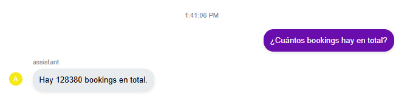
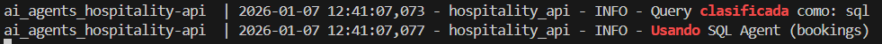
---

### Test 2: Bookings por hotel
**Query:**
```
¿Cuántos bookings hubo en el mismo hotel en 2025?
```

**Resultado esperado:**
- Clasificación: SQL
- Debe mencionar que necesita especificar un hotel

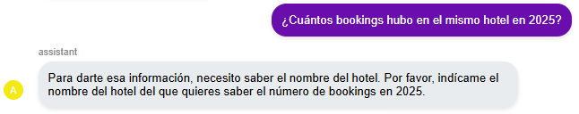

---

### Test 3: Bookings específicos
**Query:**
```
¿Cuántos bookings hubo en el Ritz Paris en 2025?
```

**Resultado esperado:**
- Número específico de bookings para ese hotel
- Clasificación: SQL
- Puede incluir desglose por tipo de habitación
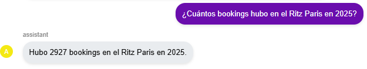
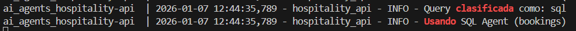
---

### Test 4: Huéspedes por país
**Query:**
```
¿Cuántos huéspedes españoles hay en las reservas?
```

**Resultado esperado:**
- Número de huéspedes con guest_country = 'Spain'
- Clasificación: SQL
- Puede incluir porcentaje del total

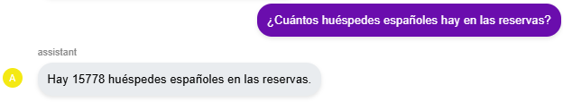
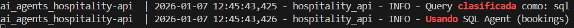


---

### Test 5: Revenue total
**Query:**
```
¿Cuál es el revenue total de 2025?
```

**Resultado esperado:**
- Suma de total_price de todas las reservas
- Clasificación: SQL
- Formato en euros (€)
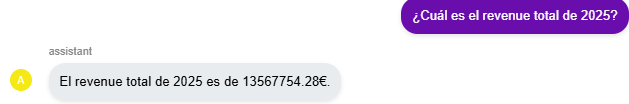
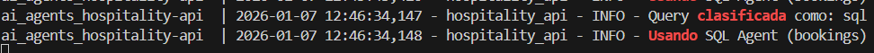

---

## Pruebas RAG Agent (Hotel Catalog)

### Test 6: Listar hoteles
**Query:**
```
¿Cuántos hoteles hay?
```

**Resultado esperado:**
```
Hay un total de 50 hoteles repartidos en 3 ciudades de Francia:
- Cannes: 22 hoteles
- Niza: 14 hoteles
- París: 14 hoteles
```
- Clasificación: RAG
- Usa tool: `list_all_hotels()`

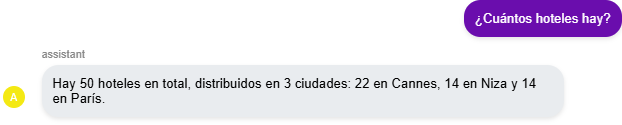
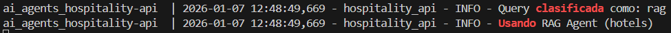

---

### Test 7: Hoteles en ciudad específica
**Query:**
```
¿Qué hoteles hay en París?
```

**Resultado esperado:**
- Lista de los 14 hoteles en París con nombres y direcciones
- Clasificación: RAG
- Usa tool: `search_hotels_by_city(city="Paris")`
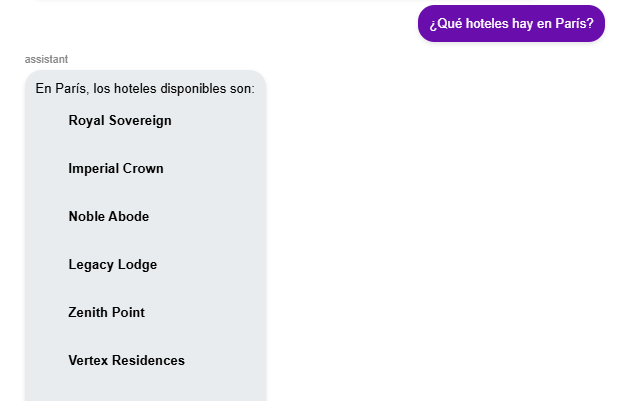
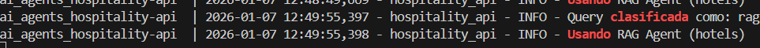
---

### Test 8: Contar habitaciones
**Query:**
```
¿Cuántas habitaciones tiene el Ritz Paris?
```

**Resultado esperado:**
- Número total de habitaciones
- Clasificación: RAG
- Usa tool: `count_rooms(hotel_name="Ritz Paris")`
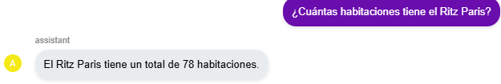
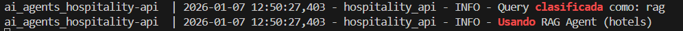

---

### Test 9: Precios base de habitaciones
**Query:**
```
¿Cuál es el precio de una habitación doble premium en el Obsidian Tower?
```

**Resultado esperado:**
- Precio en temporada baja (€X/noche)
- Precio en temporada alta (€Y/noche)
- Clasificación: RAG
- Usa tool: `get_room_prices()` o RAG directo
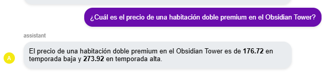
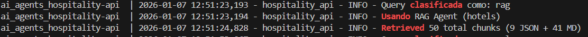
---

### Test 10: Planes de comida disponibles
**Query:**
```
¿Qué planes de comida tiene el Obsidian Tower?
```

**Resultado esperado:**
```
El hotel Obsidian Tower (hotelkey: 8235) ofrece los siguientes planes de comida:
- Room Only
- Room and Breakfast
- All Inclusive
- Half Board
- Full Board
```
- Clasificación: RAG
- Recupera JSON con MealPlanPrices
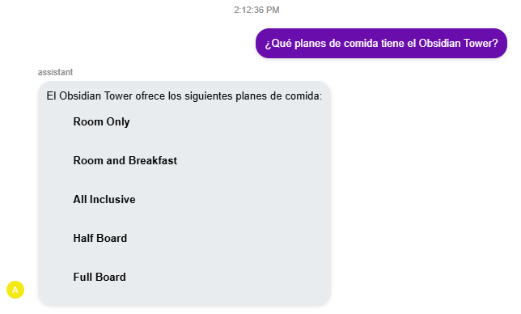
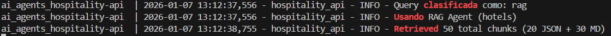

---

### Test 11: Precio con plan de comida (CRÍTICO)
**Query:**
```
¿Cuál es el precio de la habitación más cara del Obsidian Tower con All Inclusive?
```

**Resultado esperado:**
```
La habitación más cara en el Obsidian Tower es la Room 01-045, una habitación de categoría Premium para 3 huéspedes.

Su precio base en temporada alta es de 410.86€.

Con el plan de comidas "All Inclusive", el precio sería:
410.86 (precio base) × 2.03 (multiplicador All Inclusive) = 833.04€
```
- Clasificación: RAG
- Debe calcular: precio_base × MealPlanPrices["All Inclusive"]
- Multiplicador All Inclusive = 2.03

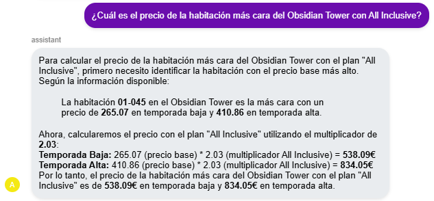
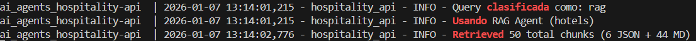

---

### Test 12: Precio más barato con plan de comida
**Query:**
```
¿Cuál es el precio más barato con Room and Breakfast en París?
```

**Resultado esperado:**
- Busca hoteles en París
- Encuentra habitación con precio off-season más bajo
- Aplica multiplicador Room and Breakfast (1.18)
- Muestra cálculo: precio_base × 1.18 = total
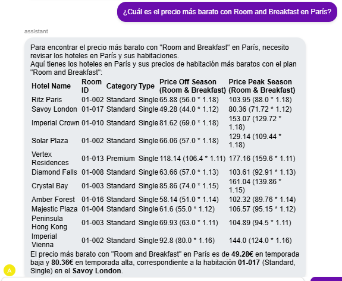
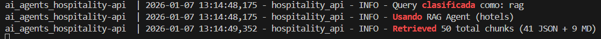
---

### Test 13: Comparación de habitaciones
**Query:**
```
Compara los precios de habitaciones triple premium en Cannes
```

**Resultado esperado:**
- Lista de hoteles en Cannes con habitaciones triple premium
- Precios en temporada alta y baja
- Ordenados por precio (opcional)
- Clasificación: RAG

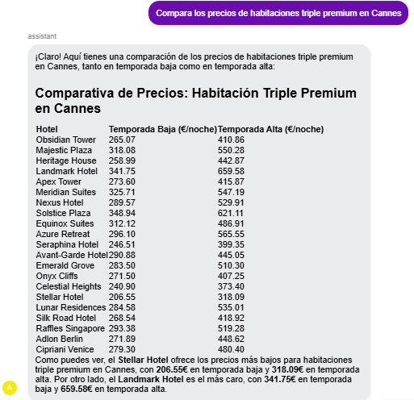
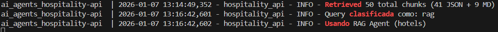
---

## Pruebas Híbridas (RAG + SQL)

### Test 14: Ocupación de hotel
**Query:**
```
¿Cuál es la ocupación del Obsidian Tower en enero 2025?
```

**Resultado esperado:**
- Primero: obtener total de habitaciones (RAG)
- Segundo: contar bookings en enero (SQL)
- Calcular: % ocupación = (bookings / habitaciones) × 100
- Clasificación: SQL o híbrido
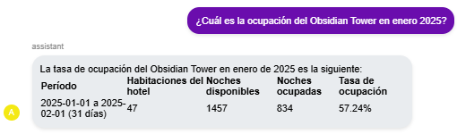
---

### Test 15: Hotel con más bookings
**Query:**
```
¿Qué hotel tiene más bookings en 2025?
```

**Resultado esperado:**
- Query SQL para contar bookings por hotel_name
- Devuelve nombre del hotel con más reservas
- Clasificación: SQL
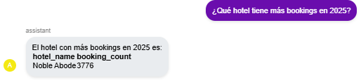
---

## Criterios de Éxito

### ✅ Todos los tests deben:
1. **Responder en < 5 segundos**
2. **Clasificarse correctamente** (RAG vs SQL)
3. **Incluir datos específicos** (no respuestas genéricas)
4. **Calcular correctamente** los precios con MealPlanPrices
5. **Mantener contexto** en conversaciones multi-turno

### ✅ Tests críticos (NO pueden fallar):
- Test 11: Cálculo de precio con All Inclusive
- Test 12: Cálculo de precio con Room and Breakfast
- Test 6: Listar todos los hoteles (debe ser 50)

### ❌ Respuestas NO aceptables:
- "No tengo información..."
- "No puedo calcular..."
- "Lo siento, no tengo acceso..."
- Números inventados o incorrectos
- Planes de comida inexistentes

---

## Ejecución de Tests

### Manual (navegador):
1. Abrir http://localhost:8001
2. Ejecutar cada query
3. Verificar resultado contra esperado
4. Capturar screenshots si es necesario

### Logs (verificación técnica):
```bash
docker compose logs -f ai_agents_hospitality-api 2>&1 | grep -E "Retrieved|Using|Clasificado"
```

### Validación de vectorstore:
```bash
curl http://localhost:8000/api/v1/heartbeat
docker exec ai_agents_hospitality-api ls -la /app/bookings-db/output_files/hotels/
```

---

## Troubleshooting

### Si falla Test 11 (precio con All Inclusive):
1. Verificar que ChromaDB tiene datos:
   ```bash
   docker compose logs chromadb | grep collection
   ```
2. Verificar que se recuperan JSONs:
   ```bash
   docker compose logs ai_agents_hospitality-api | grep "JSON docs"
   ```
3. Rebuild sin cache:
   ```bash
   ./stop-app.sh
   cd prj-docker-compose
   docker compose up -d --build --no-cache
   ```

### Si falla clasificación (RAG vs SQL):
- Revisar logs del orchestrator
- Verificar que la query contiene keywords correctas
- El orchestrator usa temperatura=0 para consistencia

---

## Evidencia

Para la entrega, capturar:
1. **Screenshots** de al menos 5 queries exitosas
2. **Logs** mostrando clasificación correcta
3. **Cálculos** de precios con MealPlanPrices
4. **Output** de `docker compose ps` mostrando servicios Up

